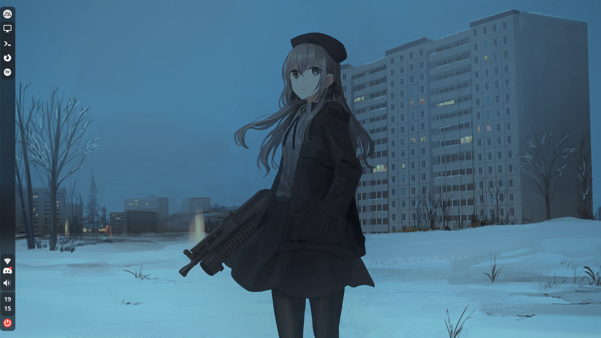

<h1 align="center">nord .files</h1>

  

  <b>Ashtrath's Nordic XFCE Rice</b>

## Thanks for coming here!

This is my personal backup of my dotfiles.

Here's stuff i used for this rice:

+ **OS**: Arch Linux
+ **DE**: [XFCE4](https://xfce.org/)
+ **Panel/Bar**: [xfce4-panel](https://gitlab.xfce.org/xfce/xfce4-panel)
+ **Font**: [JetBrainsMono Nerd Font](https://www.nerdfonts.com/)
+ **Editor**: [Neovim](https://github.com/neovim/neovim)
+ **Terminal**: [Alacritty](https://alacritty.org/)
+ **Shell**: [oh-my-zsh](https://ohmyz.sh/)
+ **Notification**: [dunst](https://github.com/dunst-project/dunst)
+ **Compositor**: [ibhagwan's picom fork](https://github.com/ibhagwan/picom)
+ **File Manager**: [Thunar](https://gitlab.xfce.org/xfce/thunar)
+ **GTK Theme**: [Nordic](https://github.com/EliverLara/)
+ **Icons**: [Papirus Dark](https://github.com/PapirusDevelopmentTeam/papirus-icon-theme)
+ **Browser**: Firefox

## Screenshot

  

  

  

