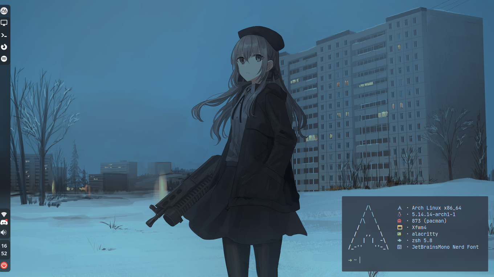
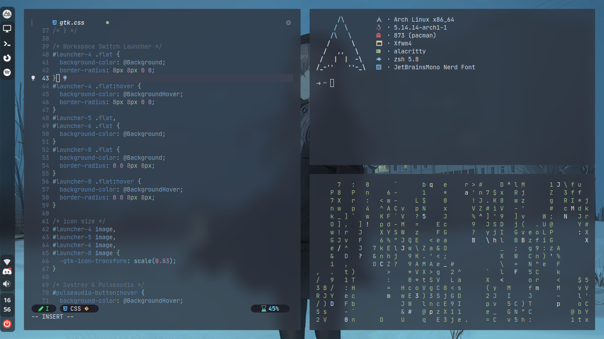

<h1 align="center">nord .files</h1>

  

My Nord XFCE dotfiles

---

## Preview
Desktop:

  

Terminal:

  

Firefox:

  

## Stuff in rice
- Distro: Arch Linux
- DE: XFCE
- GTK Theme: Nordic
- Icons: Papirus Dark
- Font: JetBrainsMono Nerd Font
- Bar/Panel: xfce4-panel
- Compositor: ibhagwan's Picom fork
- LockScreen: BetterLockScreen
- Notification: Dunst
- Shell: bash, zsh
- Terminal: Alacritty
- ImageViewer: feh
- Fetch: Neofetch
- MusicVisualiser: cava
- TextEditor: NeoVim
- FileManager: Thunar, ranger

for the xfce4-panel configuration you can read [this](/.config/xfce4-panel/README.md)
