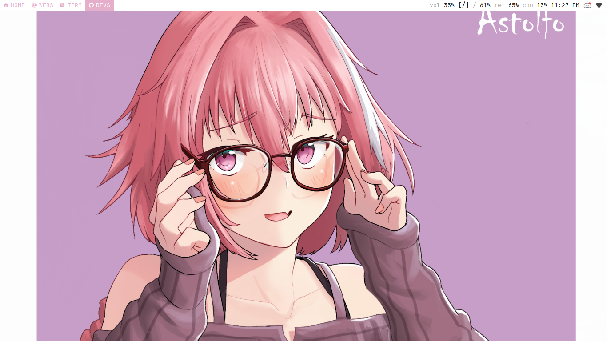
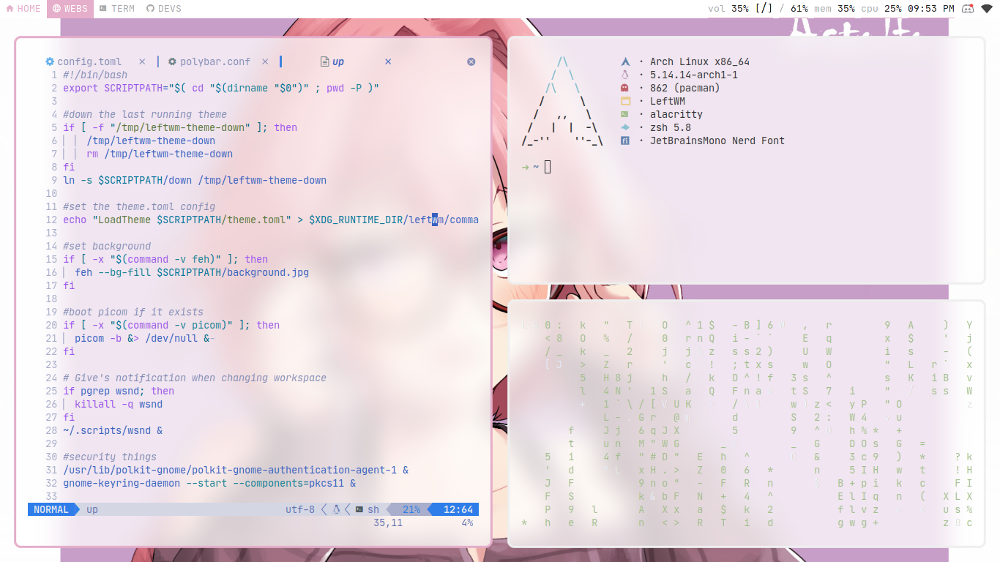

<h1 align="center">astolfo .files</h1>

  

  <b>Ashtrath's Astolfo LeftWM Rice</b>

## Stuff i used for this rice:

+ **OS**: Arch Linux
+ **WM**: [LeftWM](https://github.com/leftwm/leftwm)
+ **Panel/Bar**: [polybar](https://github.com/polybar/polybar)
+ **Font**: [JetBrainsMono Nerd Font](https://www.nerdfonts.com/)
+ **Editor**: [Neovim](https://github.com/neovim/neovim)
+ **Terminal**: [Alacritty](https://alacritty.org/)
+ **Shell**: [oh-my-zsh](https://ohmyz.sh/)
+ **Notification**: [dunst](https://github.com/dunst-project/dunst)
+ **Compositor**: [ibhagwan's picom fork](https://github.com/ibhagwan/picom)
+ **File Manager**: [Thunar](https://gitlab.xfce.org/xfce/thunar)
+ **GTK Theme**: [Qogir Light](https://github.com/vinceliuice/Qogir-theme)
+ **Icons**: [Papirus Light](https://github.com/PapirusDevelopmentTeam/papirus-icon-theme)
+ **Browser**: Firefox

## Screenshot

  

  

