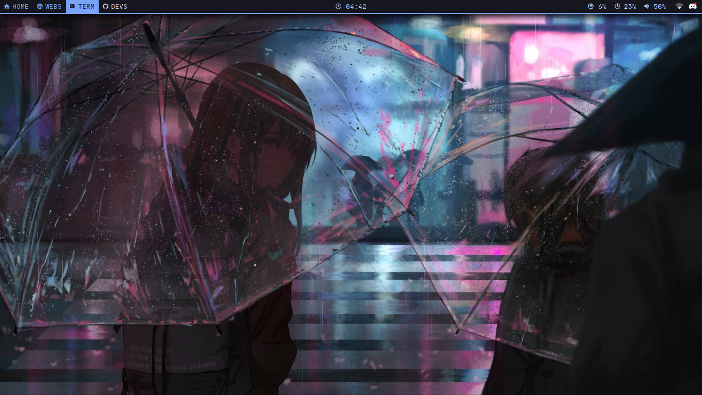
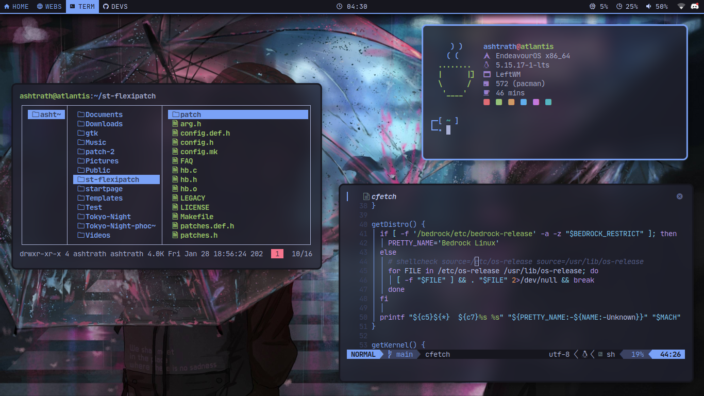
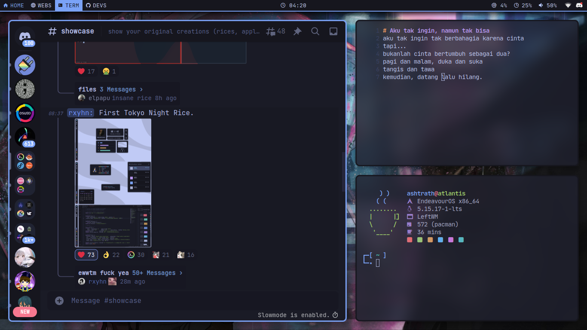
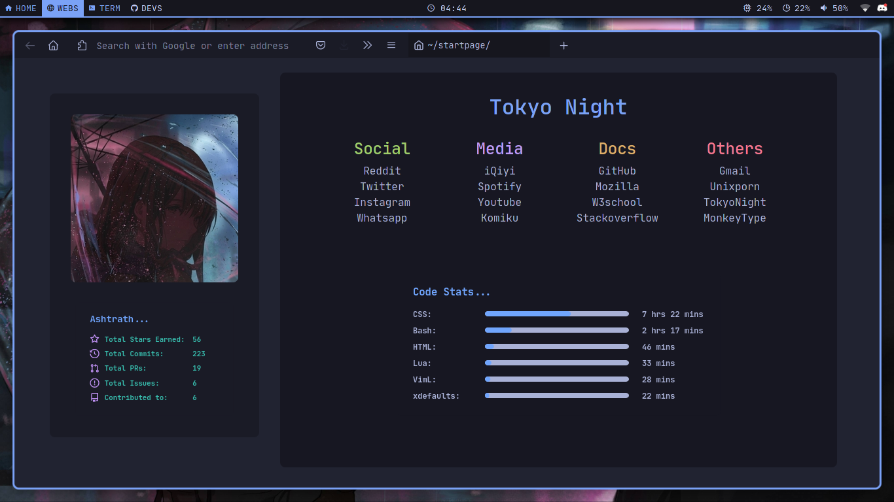

<h1 align="center">tokyo night .files</h1>

  

  <b>Ashtrath's Tokyo Night LeftWM Rice</b>

## Stuff i used for this rice:

+ **OS**: EndeavourOS
+ **WM**: [LeftWM](https://github.com/leftwm/leftwm)
+ **Panel/Bar**: [polybar](https://github.com/polybar/polybar)
+ **Font**: [JetBrainsMono Nerd Font](https://www.nerdfonts.com/)
+ **Editor**: [Neovim](https://github.com/neovim/neovim)
+ **Terminal**: [Alacritty](https://alacritty.org/)
+ **Shell**: [oh-my-zsh](https://ohmyz.sh/) with [starship](https://starship.rs/)
+ **Fetching Tool**: [coffee-fetch](https://github.com/Dyzean/coffee-fetch)
+ **Notification**: [dunst](https://github.com/dunst-project/dunst)
+ **Compositor**: [ibhagwan's picom fork](https://github.com/ibhagwan/picom)
+ **File Manager**: [Thunar](https://gitlab.xfce.org/xfce/thunar)
+ **GTK Theme**: [my phocus's fork](https://github.com/Dyzean/gtk)
+ **Discord Theme**: [Tokyo Night](https://github.com/Dyzean/Tokyo-Night)
+ **Icons**: [Papirus Dark](https://github.com/PapirusDevelopmentTeam/papirus-icon-theme)
+ **Browser**: Firefox with [Waterfall Theme](https://github.com/crambaud/waterfall)

## Screenshot

  

  

  

  

