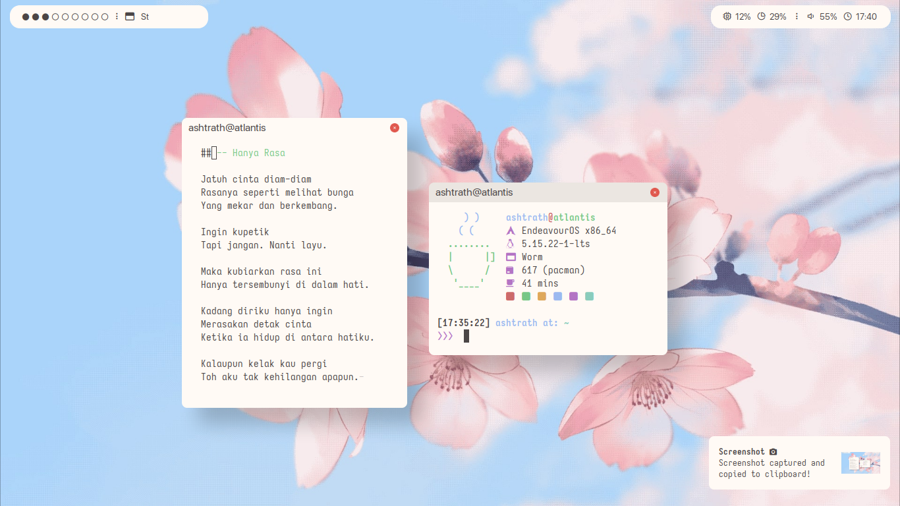
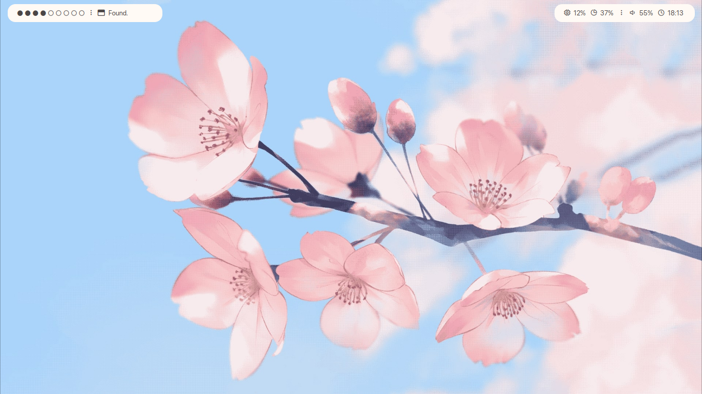
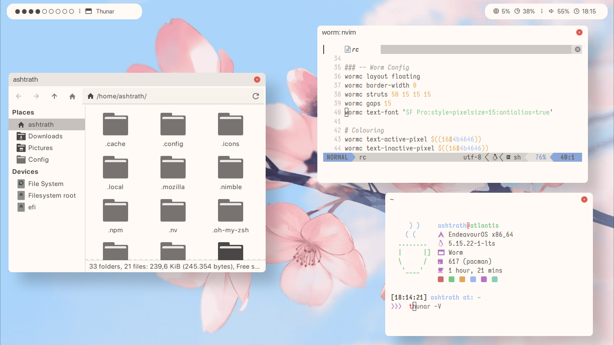
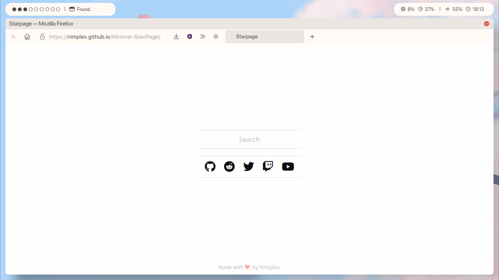

<h1 align="center">SakuraLight .files</h1>

  

  <b>Ashtrath's Sakura worm Rice</b>

## Stuff i used for this rice:

+ **OS**: EndeavourOS
+ **WM**: [worm](https://github.com/codic12/wrm)
+ **Panel/Bar**: [polybar](https://github.com/polybar/polybar)
+ **Font**: [Iosevka Mayukai Original](https://github.com/Iosevka-Mayukai/Iosevka-Mayukai), SF Pro
+ **Editor**: [Neovim](https://github.com/neovim/neovim)
+ **Terminal**: [st](https://st.suckless.org/)
+ **Shell**: [fish](https://fishshell.com/) with [starship](https://starship.rs/)
+ **Fetching Tool**: [coffee-fetch](https://github.com/Dyzean/coffee-fetch)
+ **Notification**: [dunst](https://github.com/dunst-project/dunst)
+ **Compositor**: [ibhagwan's picom fork](https://github.com/ibhagwan/picom)
+ **File Manager**: [Thunar](https://gitlab.xfce.org/xfce/thunar)
+ **Colorscheme, GTK Theme, Icons Theme**: [Sakura Light](https://github.com/Stardust-kyun/dotfiles)  *shoutout to stardust for making this colorscheme <3*
+ **Browser**: Firefox with [Waterfall Theme](https://github.com/crambaud/waterfall)

## Screenshot

  

  

  

